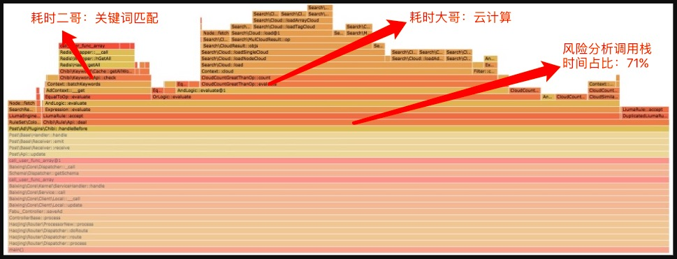
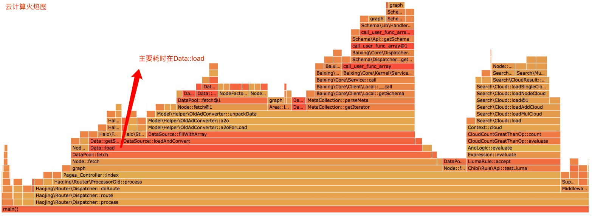
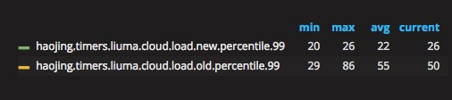
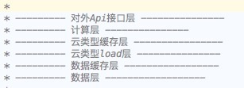
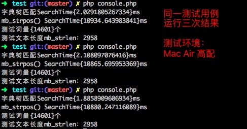
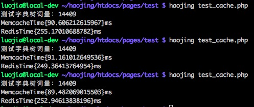
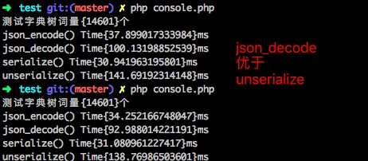
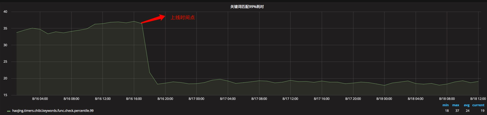
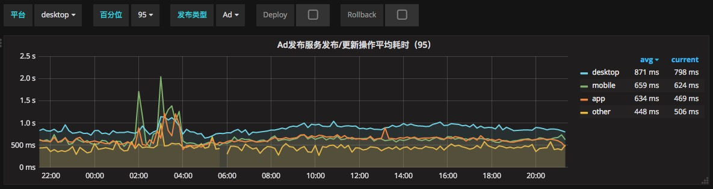
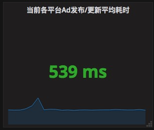

###一. 背景

用户在百姓网点击发布按钮后，除了常规的表单字段校验和入库，百姓后端的风险控制系统需要对用户输入的信息进行一系列的风险和信息质量分析，完成风险和质量分析之后才会向用户返回信息的发布状态。比较繁重的信息分析过程拉长了用户发布的响应时间，为了优化用户的发布体验，技术部门于上个月底启动了发布优化项目——“秒杀计划”。

项目启动之后，作为百姓风险控制部门的主要技术之一，荣幸而又紧张地成为了这个项目的实施者。以下便是实施这个项目的心路历程，总结下来和各位同学分享。

###二. 现状和目标

#####2.1 现状

95%发布&更新操作的平均耗时为3秒左右。
#####2.2 目标

95%发布&更新操作的三平台平均耗时降到1秒以内。
> 95%分位：一个样本集中95%的样本值都小于某一个值，取该值为该样本集的95%分位

###三. 定位问题点

整个风险控制系统像一个内部结构复杂且运载历史很长的发动机，如果你的项目时间足够充裕，可以把它的一个一个零件都研究一遍，然后一个一个换成最新款的高配版零件。但事实情况往往都是项目时间很有限，我们要在很有限的时间做出效果就需要去定位“提升空间最大”和“最容易提升”的模块或者零件。

定位问题需要获取可靠的可供分析问题的资料，本次分析主要从如下两个方面入手：

####3.1 火焰图工具

火焰图工具可以让我们直观地看到一个操作从开始到结束的程序调用栈以及每个调用栈所消耗的时间，篇幅有限，如何生成火焰图在此次不做扩展，感兴趣的同学可以自行 Goole。

下图截取自项目第一天进行的线上发布火焰图样例，不同的类目不同的用户不同的时间段都会造成火焰图的变动，下图是综合评估后较为接近平均水平的一张。



>注：火焰图的y轴表示方法调用的先后，x轴表示在每个采样调用时间内，方法所占的时间百分比，越宽代表占据时间越多

从火焰图可以直观地看到要优化的调用栈占总发布时间的占比，也能比较明确地定位出该调用栈比较耗时的子模块：

1. 云计算模块
2. 关键词模块

找到了耗时最长模块之后，又对相应的模块进行了火焰图分析。从模块的火焰图分析中可以知道云计算模块中耗时最长的为数据加载，关键词模块中耗时最长的为关键词匹配算法。

####3.2 历史的打点数据

定位了可优先优化的目标子模块，这个时候我们想知道更多的详细数据，比如目标子模块关键算法的耗时精确数据，目标子模块的慢查询 log，这个时候历史的日志数据就非常有用了。

云计算模块和关键词的慢查询日志以及关键算法的耗时打点暴露出了数据结构和算法设计的可提升之处。分析进展到这一步，发布优化这个大问题的层层迷雾已经被渐渐拨开，在心中确认优化的方向之后，就着手准备正式进入技术设计和实现。

###四. 拟定优化计划

火焰图和历史日志的分析为我们提供了几个极有优化价值的点，但并不是我们唯一可做的点。要在很有限的项目周期中做出比较可观的效果，我们得给自己可做的优化列一个执行的优先级，原则比较简单，按性价比从高到低排序。于是有了如下的初步实施计划：
 
 1. 任务异步可以有效加快响应时间，找出发布服务中可以异步的风险控制子服务，如信息质量分计算服务。将此类服务扔到队列中异步执行可以有效地给发布服务耗时做减法，经评估开发工时小于0.5工作日／1人，性价比最优，最先执行。
 2. 推进业务端对风控系统中规则引擎模块的使用优化。
 3. 优化提升潜力最大，优化难度也最高的云计算模块。
 4. 优化关键词模块。

###五. 布置验收环境

在正式开始开发之前必须要确定自己成果验收方案，建立实时的模块耗时数据打点对于此次验收是非常直观的方式。因此在开发之前首先完善了发布各平台的发布耗时打点，发布服务各模块的耗时打点，以及风险控制系统关键模块和关键算法的耗时打点。

###六. 进入开发，逐点提升

####6.1 “上小菜提神”——提炼可异步的任务

花了一个小时整理了发布服务中可以异步的风险控制子服务，花了约三小时将这些服务异步化测试上线，整个过程异常轻松。但是这碗小菜却像是从便利店买了一包速冻食品，获取得轻松愉快，却也真的没什么口感和营养——上线后发布服务的耗时曲线丝毫不为所动。看了异步化的两个服务的99%平均耗时之和是40毫秒不到之后，也充分理解了这个结果——优化的点太小。
 
####6.2 “喝口汤润胃”——推进业务端的使用优化

性能优化并不仅仅是技术的优化，有时候从业务的角度去考虑也能有一些惊喜。风险控制系统中有个重要的规则引擎模块，这个模块允许业务人员自定义规则对用户发布的信息进行风险评估。久而久之系统中积攒了大量的规则，而这些规则中也包含一些已失效却仍在空跑的规则，也包含一些可以从信息发布前移到信息发布后执行的规则。此条举措便是优化业务端对规则引擎模块的使用，降低规则引擎模块对发布服务性能的负影响。

此项优化获得了300毫秒左右的发布性能提升。

####6.3 “上盘肉来劲”——优化云计算

虽然前期已经做了充分的分析，但是到真正进入云计算的优化的时候心里还是十分忐忑的，忐忑的缘由许多同学都会似曾相识——属于底层服务且代码太难读懂，不敢改，生怕一个不小心百姓主站就挂在自己手上。

云计算优化的一整天都在看源码，当年写云计算模块的前辈的代码质量确实足以用来考验后辈，太多难以理解的变量函数命名以及复杂的逻辑跳转。大概在看了12个小时的源码之后，终于对云计算整体的逻辑有了一定的把握。下图为当时所测的云计算的火焰图：



在掌握了云计算模块的整体逻辑之后，开始定点研究云计算的 Data::load 为何耗时很长。于是便有了接下来的进展：

##### 6.3.1 加载了一大堆多余数据

为了优化搜索性能，在搜索的时候并未去数据池中将完整的数据取出，而是返回搜索对象`SearchResult`，该对象实现了`PHP`的聚合式迭代器接口`IteratorAggregate `（http://php.net/manual/zh/class.iteratoraggregate.php），使得用户在遍历搜索对象的时候才会真正地去数据池中拿出完整的数据。

例（仅作示例辅助理解，并非正式源码）：

``` 
class SearchResult implements IteratorAggregate {
	public function __construct($ids = []) {
		$this->ids = $ids;
	}
	
	public function getIds() {
		return $this->ids;
	}
	
	public function getIterator() {
		return new ArrayIterator(Node::fetch($this->ids, true));
	}

}
```
这个设计已经十分友好了，然而云计算对搜索结果的使用却不太友好。一次云计算的过程要去信息池中加载多次数据，加载次数取决于用户所发的所有帖子的云参数的多样性，加载数据量以及加载的次数和用户的发帖量成正比。云计算模块的设计缺陷导致在进行多次搜索结果的合并时，是通过遍历搜索结果合并而不是调用`getIds()`方法合并搜索结果集的`id`，而最后真正用于云计算的信息量却是加载出来的一部分。大用户越多，这种浪费越严重，因为你加载了3万的帖子，最后可能只有1000个帖子被真正用于计算（注：被用于计算的帖子量根据不同的业务情景有不同的上限值，此处1000仅用作举例无实际参考意义）。

找出了原因之后，写代码已经是体力活了。修正了云计算模块的搜索结果合并逻辑后，整个发布服务以及风险控制服务都立即有了一个令人欣喜的骤降趋势——提升了600毫秒左右。

##### 6.3.2 将云计算的搜索升级成并发，会变快的吧？

云计算模块和搜索模块的交互是通过`HTTP`请求，上面说到一次云计算要请求多次搜索模块，且请求次数和用户的发帖量成正比。如果我能实现并发请求搜索模块，就意味着我可以将原来串行的20个请求一次并行发送出去。在线下的模拟测试结果确实充分证实并行搜索比串行搜索快出很多，所以这个想法变得越来越引人入胜，虽然这项改动涉及到对云计算模块比较大的重构，但我当时深信这个开发成本肯定会有很可观的速度提升。

于是开始了这个项目耗时最长的一项优化，深度重构云计算模块。在重构了5个工作日+一整个周末后，我的代码终于通过了Mentor的审核以及反复的线下测试，就在终于松口气准备跑一下`Unit Test`就上线的时候悲剧地发现`Unit Test`没通过，更悲剧的是当我`Debug`到相应的报错函数时——那个函数有800多行，而且报错信息看不出在哪行抛出的，晴天霹雳。我至今仍无法理解，神一般的前辈自己在写那个函数的时候是怎么调试的。

新的云计算上线和旧的云计算进行对半分流`A|B`测试，测试的结果让人欣喜，新的云计算的速度提升了一倍。如下图：



看起来似乎是渐入佳境了，但如写作文的套路，用了‘似乎’的语境后面总有转折。是的，你们肯定猜到了，我全量上线新的云计算之后风险控制服务的整体耗时并没有下降，完全感觉不到降。我反复检查了自己`A|B`测试的数据是否有误，结果是`A|B`测试数据并没有问题。那么是哪？在飞爷的提点下去分析算法中耗时和调用次数正相关的的部分，果然发现在全量上线新的云计算之后，搜索模块的响应时间有一个很明显的增幅，这个增幅削平了新的云计算的算法优化。这个情况为何出现，得看一下云计算对应的搜索模块的代码，考虑项目周期原因，当时未去深究。

这项期望值很高的优化，最终以没什么速度提升效果落幕，就这个项目而言是没什么价值，但对于云计算后期长期的维护和迭代还是有意义的——重构理清了云计算模块的分层逻辑，重新组织了每一层的接口和内部方法，规范命名以及层级之间的交互。



##### 6.3.3 其他尝试

并发优化结束之后，又相继上线了云预热和云权重，这两项优化是和业务结合优化。云预热是指第一次加载云计算的时候将常用云用并发加载出来并缓存，常用云来源于历史数据的统计；云权重是为了提升云计算的准确性，也是业务特征，比如用帖子的`User`云比用`IP`云获得的计算结果更加准确。

云预热的优化效果50-100毫秒。云权重是针对业务的优化，于速度并无多少助益。

####6.4 “小碟甜点收心”——优化关键词匹配

#####6.4.1 匹配算法优化

######初级匹配算法

关键词的匹配算法初级的有`mb_strpos()`，`preg_match()`测试下来这两个的性能差不多，优化之前的关键词匹配算法用的就是`mb_strpos()`，显然还有比较大的优化空间。

######进阶选择1：hash匹配+分词

用关键词建`hash`表，用待匹配信息里的词去`hash`表里面查找，这样就能达到`O(1)`的匹配效率了。但是由于业务特征，关键词库中含有大量变形词即无语意词，无法使用现成的开源分词服务，构建分词工具又是一个很大的问题。

那么暴力拆词呢？也就是将一段文本拆成‘所有可能的’词，如‘我是女生’，拆成“‘我‘，’是‘，’女‘，’生‘，’我是‘，’是女‘，’女生‘，’我是女‘，’是女生‘，’我是女生‘”，拆词的词最小粒度和最大粒度分别为关键词的最小长度（1）和最大长度（118），难以接受的最大关键词长度来自于公安下发的敏感关键词。这个最大长度直接导致拆词的效率不高且拆出了非常多的无意义词，即便最后的匹配效率是`O(1)`，整个匹配的时间对比之前并没有明显的优化。

######进阶选择2：字典树匹配

用字典树`TrieTree`算法进行关键词匹配，字典树可以非常好地减少无谓字符的比较，使得搜索的时间复杂度理论上只和待检索文本的长度有关：`O(m)`，其中`m`为待检索文本的长度。

> 字典树入门推荐文章：
> https://segmentfault.com/a/1190000008877595

本文主要讲优化的思路和策略，对于详细的算法细节不做铺开，字典树详细的实现算法本人写了一个`PHP`版（https://github.com/summer1914/PHP-TrieTree），有兴趣的同学可以看看，欢迎给我提优化建议。

线下算法匹配性能测试结果：




#####6.4.2 缓存结构优化

字典树的匹配效率虽高，但是若每次加上字典树的`build`时间，那么优化的效果又会大打折扣。因此使用时字典树都是提前`build`，将依据建立好的字典树序列化之后存到`Redis`缓存，使用时从`Redis`取出并且反序列化。

这里引入了另一个问题（坑），那就是序列化的效率。在之后的测试中发现真正进入使用时，整体匹配的速率没有达到预期的增长。什么原因？查询算法很快，`Redis`是内存级存储取出速度很快，那么慢的是谁？反序列化！果然测试最大的一颗字典树，从取出到匹配完成总耗时61毫秒，匹配耗时2毫秒+，Redis取出耗时5毫秒+，而反序列化直接占了52毫秒！这个很坑的反序列化函数是我们常用的`json_decode()`。

######Memcache VS Redis

为了解决这个问题，想到可以直接将字典树不序列化存到`Memcache`中(注：`Memcache`内部会做序列化和反序列化)。但`Memcache`存储不够安全，所以可以将`Memcache`作为最上层缓存，`Redis`作为兜底缓存。在正式执行这个想法之前进行了一波线下测试，测试结果如下图：



######json_decode() VS unserialize()

后来在剑剑的提醒下又引入了`serialize()/unserialize()`和`json_encode()/json_decode()`的对比测试，测试结果如下图：



经过了以上测试，最后上线的关键词模块为：匹配算法采用字典树，第一层缓存为`Memcache`，第二层缓存为`Redis\Str`。上线之后的效果图如下：



最后折射到发布服务的提升为300-400毫秒。

###七. 项目优化成果

####7.1 “秒杀计划一期”项目周期

2017年7月31号接手项目到2017年8月16号结束项目，共计13个工作日。人员投入：研发工程师1人/13天，业务人员1人/2天，为项目提供了建议的工程师`N`人。

####7.2 项目优化结果

2017-08-16 21:25 到 2017-08-17 21:25 数据如下：

###### 各平台95%分位统计：



###### 平均95%分位统计：



###八. 一些进一步提升的思考

1. 关键词模块想达到最好的优化效果，应是做成服务，这样生成的字典树可常驻进程。目前的关键词匹配最耗时的部分是从缓存中取出字典树。
2. 字典树算法还有提升空间，目前实现的标准字典树在大小上和匹配性能上都不是最优。
3. 风险控制系统可以按文本，图片，音频，视频进行模块拆分服务化，服务化之后可以更进一步地做并发优化。

> {{ page.date | date_to_string }}，原创文章，转载请注明出处