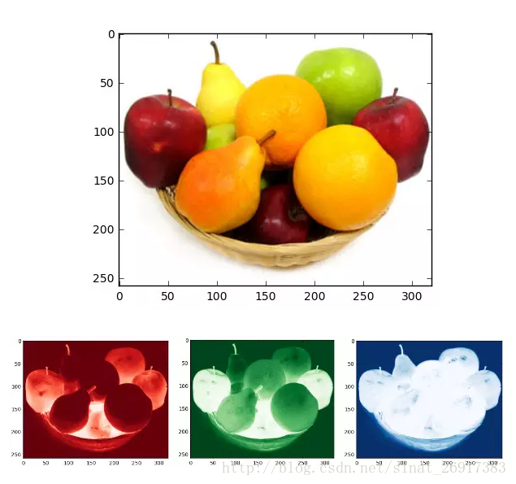
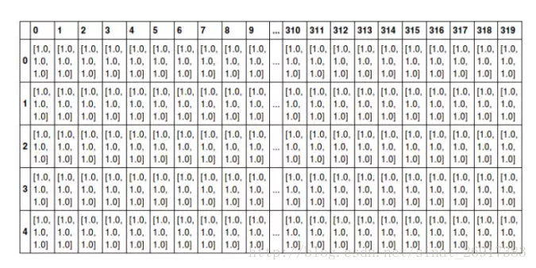

> 摘要：本文主要总结 TensorFlow 中的基础概念，包括张量，图，操作，会话。

# 1.1 张量

`Tensor` 意味张量， `Flow` 意为流动，任意维度的数据（一维数组，二维矩阵，N 维矩阵......）都可以称作“张量”，`TensorFlow` 直译成中文的意思就是“张量流”。他最初想表达的意思是保持计算节点不变，让数据在不同的计算设备上传输并计算。

`TensorFlow` 采用张量的数据结构来表示它内部的所有数据，也只有张量形式的数据才可以在不同的计算设备和计算操作之间传递。每个张量都有自己的静态类型，以及张量的形状。张量是所有深度学习框架中最核心的组件，因为后续的所有运算和优化算法都是基于张量进行的。通俗一点理解的话，我们可以将标量视为零阶张量，矢量视为一阶张量，矩阵视为二阶张量。

我们可以将任意一张 RGB彩色图片表示成一个三阶张量，三个维度分布是图片高度，宽度和色彩数据。如下，是图片效果和截取的图片的前5行320列的数据，每个放歌代表一个像素点，方格中的数据为颜色值。将这个示例进行扩展，我们可以用四阶张量表示一个包含多张图片的数据集，四个维度分别是：图片在数据集中的编号，图片的高度，宽度以及色彩数据。




```
import numpy

//将图片转成张量
img = numpy.read('images/test.png')

//将张量转成图片
numpy.save('images/test.png', img)

```

# 1.2 图

> 为什么需要图？有了张量和基于张量的各种运算操作之后，按理直接算就行了，要图做什么。但是不幸的是，由于深度学习往往涉及的操作量极大，操作间的依赖关系也会比较复杂，这时候如何协调各种不同的底层设备以及避免各种冗余操作就是问题了——于是计算图应运而生。因为计算图的引入，开发者得以从宏观上俯瞰整个神经网络的内部结构，就好像编译器可以从整个代码的角度决定如何分配寄存器那样，计算图也可以从宏观上决定代码运行时的 GPU 内存分配，并且决定在分布式环境中不同底层设备间的相互协作的方式。

## 动态计算图

动态框架中使用动态计算图，计算的声明和执行是一起进行的，类似于我们平时写程序的方式。常见框架有 Torch，DyNet，Chainer。

## 静态计算图

在静态框架中使用的是静态声明策略，计算图的声明和执行是分开的。类似在造楼的时候需要设计图纸和施工队施工，当设计师在设计图纸的时候，施工队什么也不干，等所有设计图纸设计完之后施工队才开始施工，这两个阶段完全分开。

在静态图中，先定义计算执行顺序和内存空间分配策略，然后执行的过程按照规定的执行顺序和当前的需求进行计算，数据就在这张实体计算图中进行计算和传递。常见的框架有 TensorFlow，MXNet，Theano。

## 总结

动态框架灵活性很好，但是灵活往往有资源上的代价，动态框架每次规划执行的时候都只能看到局部需求，所以并不能做出全局最优的规划和内存分配。因此现在流行的框架中，静态框架占比更高。静态框架在执行前就知道了所有需要进行的操作，所以可以对图中各节点的计算顺序和内存进行合理规划。

目前业界流行的开发框架是，前端使用 Python 等脚本语言建模（画图），后端用 C++ 等低级语言执行，以此综合二者的优点。

# 1.3 操作

我们在图中描述计算顺序，图中的节点就是操作，一次加法，一次乘法以及构建变量的初始值都可以算做“操作”。操作可以和计算机设备绑定，我们可以指定操作在某个设备上运行。

操作之间存在顺序关系，有的操作在其他操作执行完成之后才可以执行，这些操作之间的依赖就是“边”。在代码编程上，如果操作A的输入是操作B的执行结果，那么这个操作A就依赖操作B。

```
import tensorflow as tf

a = tf.Varible(1.0, name="a")
b = tf.add(a, 1, name="b")    //b操作依赖a操作
c = tf.add(b, 1, name="c")    //c操作依赖b操作

```

# 1.4 会话

TensorFlow 的计算需要在会话中执行，当创建一个会话的时候，如果传递参数，默认情况会启动默认的图来构造图结构，并且按照图中定义的 op 根据设定分发到 CPU 或者 GPU 设备上去。

示例，计算 1+1 ：

```
import tensorflow as tf

# 构件图：定义两个常量和加法操作
# 注意：构建图的时候并没有执行实际的赋值
v1 = tf.constant(1, name="value1")
v2 = tf.constant(1, name="value2")
add_op = tf.add(v1, v2, name="add_op")

# 在会话中执行操作
with tf.Session() as sess:
	result = sess.run(add_op)
	print("1+1 = %.0f" % result)

```

> 为什么要弄个会话？深度学习的计算很大一部分都是矩阵和向量的计算，采用 GPU 的计算速度比 CPU 在速度上会有一个数量级的差别。如果直接使用 Python 的对象进行计算， Python 的变量是在 CPU 上的，所以数据会频繁地在 GPU 的显存和 CPU 的内存传送，效率会大大降低。采用会话，可以让实际的运算在 Python 之外独立运行。
