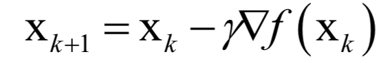
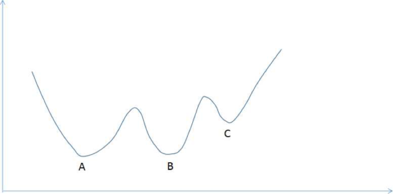
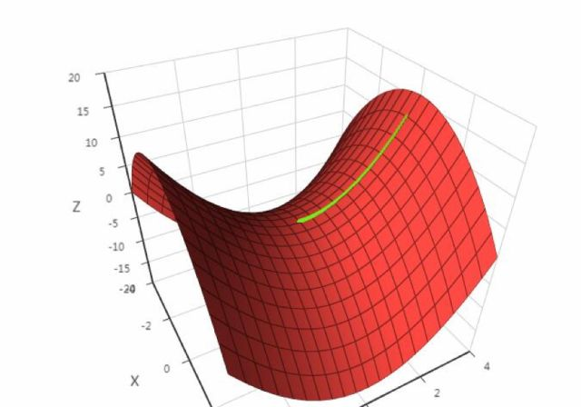

总结在机器学习中常用的优化方法：梯度下降法，牛顿法，拟牛顿法，坐标下降法

### 一 梯度下降法

我们再训练中想解决的最优化问题可以理解为函数的求极值问题。大学时学的微积分为我们求函数的极值提供了一个统一的思路：找函数的倒数等于0的点，因为在极值点处。导数必定为0.这样，只要函数是可导的，我们就可以用这个方法解决问题，幸运的是，在实际应用中我们遇到的函数基本上都是可导的。

梯度下降法沿着梯度的反方向进行搜索，利用了函数的一阶导数信息。公式如下：

根据函数的一阶泰勒展开，在负梯度方向，函数值是下降的。只要学习率设置的足够小，并且没有达到梯度为0的地方，每次迭代函数值一定会下降。

> 实操中为什么将学习率设置为一个非常小的正整数？保证迭代后的X(k+1)位于迭代之前的X(k)的邻域内，避免跳过最佳路径。

#### 面临的问题

__局部最小值__ ：有的函数可能有多个局部极小值点，梯度下降法可能在一个非全局最小值的局部最小值点就终止优化了。

__鞍点__ ： 鞍点是指梯度为0，Hessian矩阵既不是正定也不是负定，即不确定的点。如下图，黄色的曲线处梯度下降遇到了鞍点，认为已经招到了极值点，从而终止迭代过程，而这里根本不是极值点。

#### 梯度下降法的变种

1. 为迭代公式加上动量项，动量项积累了之前的权重更新值，即积累了之前的梯度信息，类似于保持行走时的稳定，以避免来回震荡，加快收敛速度。
2. AdaGrad 自适应梯度下降，它会根据前几轮迭代时的历史梯度来调整学习率。
3. ......

#### 随机梯度下降法

对于很多机器学习的问题，我们的目标函数是对样本的损失函数。而在很多实际应用中，样本数量很大，网络的层级也很深，也意味着需要训练的参数极多。此时如果每次训练时都用所有的样本计算梯度并更新，成本太高，作为改进，可以每次迭代的时候选一批样本将损失函数定义在这些样本上。

随机梯度下降法在数学期望上的意义下收敛，即随机采样产生的梯度的期望值是真实的梯度。因为每次迭代时的目标函数实际是不一样的，因此随机梯度下降法并不能保证每次迭代时全局样本的损失函数值一定下降。

### 二 牛顿法

数学知识告诉我们，一阶导数代表函数变化的方向和速度，二阶导数则代表“变化”变化的方向和速度。而牛顿法正是利用了函数的一阶和二阶导数信息，直接寻找梯度为0的点。

牛顿法比梯度下降法有更快的收敛速度，但每次迭代时需要计算 Hessian 矩阵，并且求解一个线下方程组，运算量更大。并且，如果 Hessian 不可逆，这种方法就失效了。

### 三 拟牛顿法

### 四 坐标下降法

