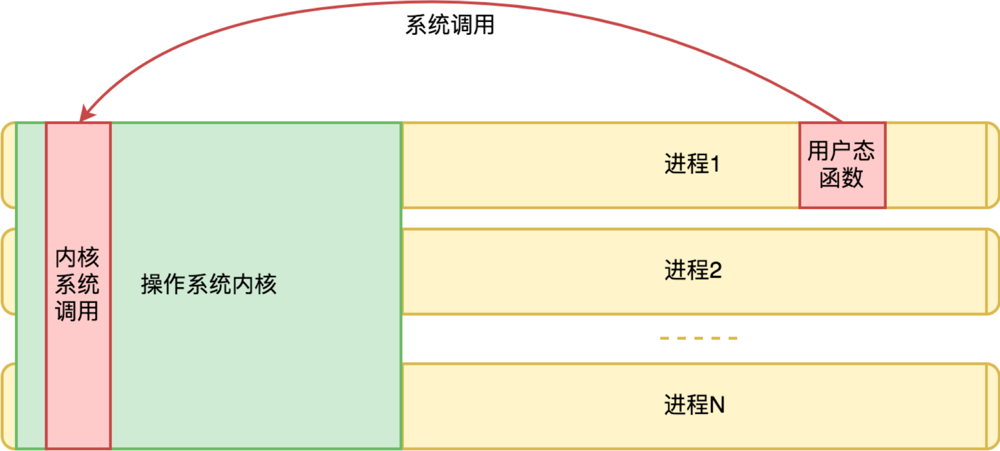

今天来研究一下上层软件如何调用操作系统的能力。

如果是实模式的操作系统，软件和操作系统都在一个进程，只要知道操作系统的接口函数地址，理论就可以直接访问。但目前我们使用的主流的操作系统基本上是保护模式的，操作系统和软件不在同一个进程，我们今天要讨论的是这个模式下的调用。

不在一个进程，我们自然能想到是进程和进程之间的通信机制，rpc、socket通信，但，这些通信方式成本实在太高，显然不合适。软件进程使用操作系统的通信方式应该是一种成本非常低非常低的方案，不然，我们为保护模式付出的代价就太高了。

有这样的机制么？有，就是上一篇笔记我们提到过的“中断”。

中断的设计初衷是 CPU 响应硬件设备事件的一个机制，当某个输入输出设备需要使用CPU，他就会触发一个中断；但CPU也提供了指令允许软件触发一个中断，我们把它叫做软中断。大部分情况，操作系统的能力通过软中断向我们写的软件开放，也叫做“系统调用”

### 系统调用如何工作

在保护模式下，CPU引入了“保护环”的概念，也就是代码是有执行权限等级的，如果权限不够，有一些CPU指令就不能执行。我们通常所说的操作系统是很泛的概念，完整的操作系统非常庞大，根据与应用的关系，我们可以把操作系统氛围内核与外围。所谓操作系统内核，其实就是哪些会向我们写的应用程序提供系统服务的子系统的集合，他们管理所有计算机的硬件资源，也管理着所有运行的应用软件。

操作系统内心的执行权限等级和我们常规的软件进程不同，想英特尔CPU通常把代码执行权限分为 Ring 0-3 四个等级。操作系统内核通常运行在 Ring 0 ，而常规的软件进程运行在 Ring 3

系统调用所基于的软中断，很像一次间接的“函数调用”，但又颇有不同。在实模式下，这种区别并不强烈，但在保护模式下，这种差异十分明显。原因在于，我们的应用程序通常在 Ring3 即用户态，而操作系统运行在 Ring 0（内核态）。所以一次中断调用，不只是“函数调用”，更重要的是改变了执行权限，从用户态跃迁到了内核态。且，在保护模式下，操作系统与我们的软件不同属于一个进程，两边的内存地址空间都是独立的，我们的系统调用请求是过去了，但是我们传给操作系统的内存地址是有意义的吗？当然是有意义的，在虚拟内存机制的视角，操作系统内核和所有进程都在同一个地址空间，也就是，操作系统内核，它是所以进程共享的内存。示意如下图：

操作系统内核的代码和数据，不只为所有的进程共享，而且在所有进程中拥有相同的地址。这样无论哪个进程请求过来，对内核来说看起来都像是一次本进程内的请求。

从单个进程的角度，中断向量表的地址以及操作系统内核地址空间是一个契约。有了中断向量表的地址约定，用户态函数就可以发起一次系统调用也就是软中断。
